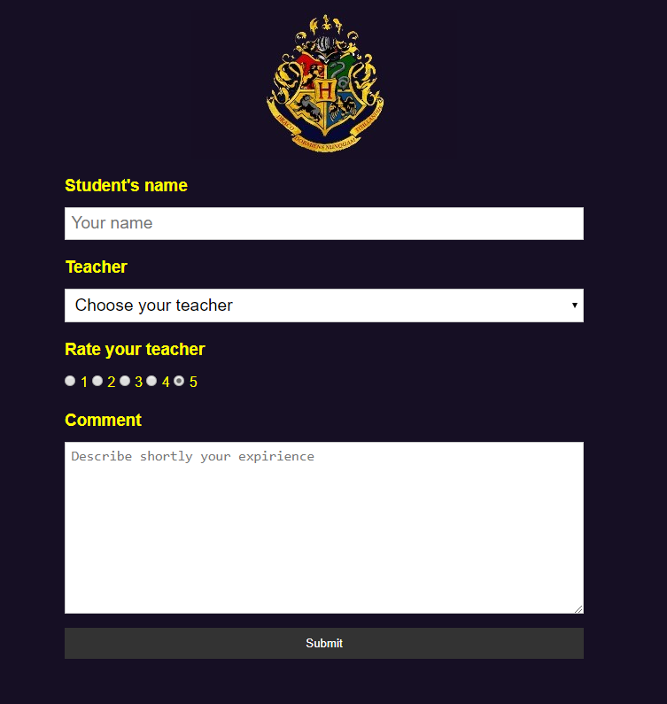

# Feedback Flask App
This is my simple version of a feedback app using Flask freamwork and postgres database with some Hogwarts content :)

# Screenshot


## Email notification
If you want to receive an email notification when someone completes the survey, just uncomment this line 
```python
send_mail(student, teacher, rating, comments)
```
and fill in your email credentials in send_mail.py 
